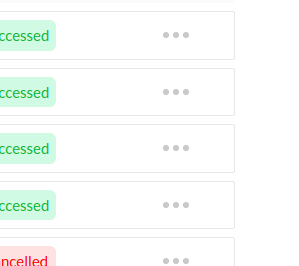

# OverlayMenu

This module is to create an overlay type of menus with an auto cancellation feature. You can create your own menu design and then just wrap that menu with this OverlayMenu component and pass the values `visible, setVisible` state and `container_ref` this will be ref to your menu container to work auto-cancel feature properly.

### Here is code example:

```js
import OverlayMenu from "overlaymenu";
import { useRef, useState } from "react";
function App() {
  const [visible, setvisible] = useState(false);
  const container_ref = useRef();

  return (
    <div>
      <div ref={container_ref}>
        <h1 onClick={() => setvisible(!visible)}>Menu</h1>
        <OverlayMenu
          container_ref={container_ref}
          visible={visible}
          setVisible={setvisible}
        >
          <div>
            <div>item</div>
            <div>item2</div>
            <div>item3</div>
          </div>
        </OverlayMenu>
      </div>
    </div>
  );
}

export default App;
```

### Menu created with overlaymenu



> You can create your custom modal, menu, dropdowns, and more with this module.

> Overlaymenu will be disappeared if you click outside of the menu or press the ESC key on the keyboard.
